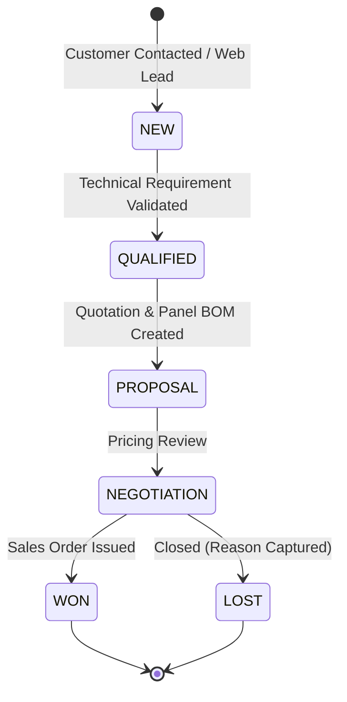
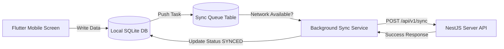

# 06. Role & Permission Matrix (RBAC & PBAC)

## 1. System Roles
1. **Super Admin / System Administrator** (`ROLE_ADMIN`)
2. **Sales Manager** (`ROLE_SALES_MGR`)
3. **Sales Executive** (`ROLE_SALES_EXEC`)
4. **Purchase Manager** (`ROLE_PURCHASE_MGR`)
5. **Store / Inventory Manager** (`ROLE_STORE_MGR`)
6. **Production & Panel Engineering Head** (`ROLE_PRODUCTION_MGR`)
7. **Accountant / Finance Controller** (`ROLE_ACCOUNTANT`)
8. **HR Manager** (`ROLE_HR`)

---

## 2. Permission Matrix Breakdown

| Permission Module | Action | Super Admin | Sales Mgr | Sales Exec | Purchase Mgr | Store Mgr | Prod Mgr | Accountant | HR Mgr |
|---|---|:---:|:---:|:---:|:---:|:---:|:---:|:---:|:---:|
| **ADMIN** | VIEW/EDIT | ✅ | ❌ | ❌ | ❌ | ❌ | ❌ | ❌ | ❌ |
| **CUSTOMERS** | VIEW | ✅ | ✅ | ✅ | ✅ | ✅ | ✅ | ✅ | ❌ |
| **CUSTOMERS** | CREATE/EDIT | ✅ | ✅ | ✅ | ❌ | ❌ | ❌ | ❌ | ❌ |
| **CUSTOMERS** | DELETE | ✅ | ✅ | ❌ | ❌ | ❌ | ❌ | ❌ | ❌ |
| **CRM / LEADS** | VIEW/CREATE | ✅ | ✅ | ✅ | ❌ | ❌ | ❌ | ❌ | ❌ |
| **CRM / LEADS** | APPROVE | ✅ | ✅ | ❌ | ❌ | ❌ | ❌ | ❌ | ❌ |
| **PANEL MFG** | DESIGN/BOM | ✅ | ✅ | ✅ | ❌ | ❌ | ✅ | ❌ | ❌ |
| **PURCHASE** | VIEW/CREATE | ✅ | ❌ | ❌ | ✅ | ✅ | ❌ | ✅ | ❌ |
| **PURCHASE** | APPROVE | ✅ | ❌ | ❌ | ✅ | ❌ | ❌ | ❌ | ❌ |
| **INVENTORY** | STOCK ISSUE | ✅ | ❌ | ❌ | ✅ | ✅ | ✅ | ❌ | ❌ |
| **ACCOUNTS** | INVOICE/POST | ✅ | ❌ | ❌ | ❌ | ❌ | ❌ | ✅ | ❌ |
| **DOCUMENTS** | UPLOAD/VIEW | ✅ | ✅ | ✅ | ✅ | ✅ | ✅ | ✅ | ✅ |
| **HR / DIRECTORY**| VIEW/MANAGE | ✅ | ❌ | ❌ | ❌ | ❌ | Team | ❌ | ✅ |
| **HR / MUSTER**   | FORM 25 REG | ✅ | ❌ | ❌ | ❌ | ❌ | Floor | ❌ | ✅ |
| **HR / BAY ALLOC**| ROSTER BAYS | ✅ | ❌ | ❌ | ❌ | ❌ | ✅ | ❌ | View |
| **HR / OVERTIME** | LOG/APPROVE | ✅ | ❌ | ❌ | ❌ | ❌ | Log/Approve | ❌ | Finalize |
| **HR / SAFETY**   | EHS LOG/AUDIT| ✅ | ❌ | ❌ | ❌ | ❌ | ✅ | ❌ | ✅ |
| **HR / PAYROLL**  | RUN/DISBURSE| ✅ | ❌ | ❌ | ❌ | ❌ | ❌ | Reports | ✅ |

---

# 07. Business Workflows & State Machine Specifications

## 1. CRM Lead to Sales Flow State Machine



---

# 08. File Storage Architecture Specification

## 1. Provider Switching & Adapter Strategy

```typescript
export enum StorageProvider {
  LOCAL = 'local',
  S3 = 's3',
}

export interface StorageResult {
  fileName: string;
  storagePath: string;
  mimeType: string;
  fileSize: number;
  publicUrl: string;
}
```
- When `STORAGE_PROVIDER=local`, files are stored under `/storage/documents/:entity/:entityId/:filename`.
- When `STORAGE_PROVIDER=s3`, files are pushed to `s3://${S3_BUCKET}/documents/:entity/:entityId/:filename`.
- NestJS Controller routes stream download tokens so frontend applications never depend on explicit disk or S3 URLs.

---

# 09. Offline Sync Architecture Design

## 1. Field Mobile Offline Queue Architecture



Each local sync queue entry contains:
- `localId`: UUID v4
- `entityName`: "customer_interaction" | "task"
- `payload`: JSON String
- `syncStatus`: "PENDING" | "SYNCING" | "SYNCED" | "FAILED"
- `retryCount`: Int
