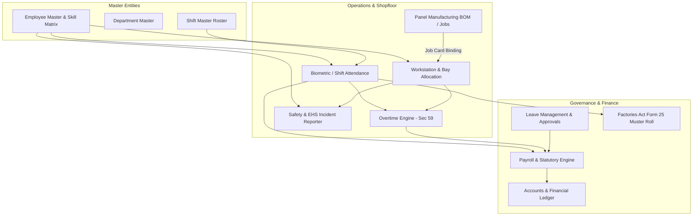
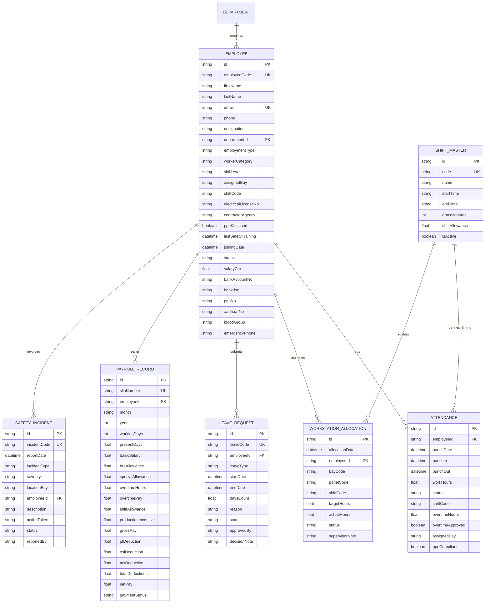

# 12. Human Resources & Industrial Workforce Management Module (MOD-12)

## 1. Executive Summary & Domain Scope

In an industrial engineering and panel manufacturing facility like **Saark Exploration Private Limited**, the Human Resources (HR) module serves as both a strategic personnel platform and a real-time shopfloor labor dispatch engine. 

Unlike standard office HR tools, Saark ERP's HR module harmonizes:
1. **Dual Workforce Management**: White-collar executives (Designers, Estimators, Sales) alongside blue-collar technical labor (Certified Wiremen, Busbar Fitters, Testing Engineers, Apprentices, and Third-Party Contractors).
2. **Statutory Industrial Compliance**: Strict adherence to the **Indian Factories Act, 1948** (Form 25 Muster Roll, Shift Rotations, Section 59 Overtime double-wage rules, Weekly Offs).
3. **Shopfloor Bay & Workstation Allocation**: Dynamic assignment of technicians to assembly bays linked directly to active panel manufacturing jobs (`PANEL-2026-XXXX`).
4. **Environment, Health & Safety (EHS)**: Daily PPE kit verification, high-voltage test bay hazard tracking, arc flash/burn incident reporting, and mandatory safety certifications.
5. **Industrial Payroll & Statutory Deductions**: Automated compensation engine calculating Basic, HRA, Shift Allowance, Overtime Wages (2.0x base), PF (EPF 12%), ESI, Professional Tax (PT), and TDS.

---

## 2. High-Level System Architecture & Integrations



---

## 3. Core Functional Pillars

### 3.1 Workforce Master & Skill Matrix
- **Employee Categorization**:
  - `STAFF_OFFICE`: Designers, Sales, Accounts, Procurement.
  - `SHOPFLOOR_TECH`: Permanent assembly, wiring, busbar, and testing technicians.
  - `CONTRACT_LABOR`: Temporary agency staff (e.g. Apex Industrial Solutions) for peak production spikes.
  - `APPRENTICE`: Government NEEM / NAPS technical trainees.
- **Electrical & Technical Skill Hierarchy**:
  - `LEVEL_1_TRAINEE`: Mechanical enclosure prep, tray routing.
  - `LEVEL_2_WIREMAN`: Control and power wiring, ferrule labeling, crimping.
  - `LEVEL_3_BUSBAR_SPECIALIST`: Copper busbar bending, punching, torque calibration.
  - `LEVEL_4_TESTING_EXPERT`: High-voltage insulation, FAT testing, relay calibration.
  - `STAFF_ENGINEER`: PLC/VFD programming and panel architecture.
- **Statutory Identity Compliance**: PAN, Aadhaar, Bank Details (IFSC/Account), State Wireman License Number (`MH-PWD-WIREMAN-XXXX`).

### 3.2 Shifts & Biometric Attendance (Factories Act 1948)
- **Multi-Shift Roster**:
  - `SHIFT_G` (General Day): 08:30 – 17:00 (Engineering, Admin, General Shopfloor)
  - `SHIFT_A` (Morning Assembly): 06:00 – 14:30 (Fabrication & Busbar)
  - `SHIFT_B` (Afternoon Wiring): 14:00 – 22:30 (Wiring & Component Mounting)
  - `SHIFT_N` (Night Testing & Dispatch): 22:00 – 06:30 (High-Voltage FAT, Packing)
- **Grace Minutes & Shift Allowances**: Built-in grace window (15 mins) and automated night/hardship allowances added directly to payroll.
- **Form 25 Muster Roll**: Real-time generation of statutory monthly attendance register showing Present (P), Absent (A), Half-Day (HD), Paid Leave (PL), Sick Leave (SL), and Overtime Hours (OT).

### 3.3 Shopfloor Bay Allocation & Job Binding
Direct linkage between human labor and production assets:
- **Assembly Bays**:
  - `BAY_1_FABRICATION`: Sheet metal enclosure unboxing & structure prep.
  - `BAY_2_BUSBAR`: Copper/Aluminum busbar cutting, bending, and sleeve heat shrinking.
  - `BAY_3_MOUNTING`: DIN-rail, contactor, MCB/MCCB, and VFD chassis placement.
  - `BAY_4_WIRING`: Control loop wiring, ferrule numbering, harness bundling.
  - `BAY_5_FAT_TESTING`: Factory Acceptance Testing, dielectric test, mega-ohm tests.
  - `BAY_6_DISPATCH`: Final inspection, QC signoff, crating and dispatch.
- **Efficiency Metric**: Target hours vs. Actual hours logged per panel job card.

### 3.4 Overtime Engine (Factories Act Section 59)
- **Statutory Requirement**: Any work beyond 9 hours in a day or 48 hours in a week must be compensated at **double the ordinary rate of wages** (`Hourly Rate x 2.0`).
- **Supervisory Approval Workflow**: Shopfloor bay supervisor verifies extra hours before the payroll engine absorbs OT compensation.

### 3.5 Environment, Health & Safety (EHS)
- **Mandatory PPE Check-in**: Verification of safety shoes, safety glasses, and arc-rated gloves prior to bay entry.
- **Incident & Near-Miss Log**: Severity classification (`LOW`, `MEDIUM`, `HIGH`, `CRITICAL`) with root cause analysis and corrective action tracking.

### 3.6 Leave Management
- **Entitlement Types**: Casual Leave (CL), Sick Leave (SL), Earned Leave (EL), Maternity/Paternity, and Loss of Pay (LOP).
- **Approval Workflow**: Subordinate -> Department Head / Production Manager -> HR Head.

### 3.7 Industrial Payroll & Statutory Compliance
- **Earnings Components**:
  - Basic Pay (50% of CTC)
  - House Rent Allowance (HRA - 40% of Basic)
  - Special Allowance (Balance balancing CTC)
  - Overtime Pay: $\frac{\text{Basic} + \text{DA}}{\text{Working Days} \times 8} \times 2.0 \times \text{OT Hours}$
  - Shift Allowances (Night shift ₹150–250/shift)
  - Production Incentive (Bonus for on-time FAT testing completion)
- **Deductions Components**:
  - Provident Fund (EPF): 12% of Basic (capped at statutory ₹1,800 or full)
  - ESI (Employee State Insurance): 0.75% of Gross Pay (for employees under ₹21,000 gross)
  - Professional Tax (PT): State slab (e.g. Maharashtra ₹200/month, ₹300 in Feb)
  - Tax Deducted at Source (TDS): Income tax slab calculation
- **Pay Slip Generation**: Instant PDF generation and automated salary disbursement register.

---

## 4. Entity Relationship Diagram (ERD)



---

## 5. REST API Endpoints Specification

Base path: `/api/v1/hr`

| Method | Endpoint | Description | Guard / Roles |
|---|---|---|---|
| `GET` | `/dashboard` | HR Executive & Shopfloor KPI Metrics | All Authenticated Staff |
| `GET` | `/shifts` | List shift timings & allowances | HR, Prod Mgr, Admin |
| `GET` | `/workstations` | Current shopfloor bay allocations | HR, Prod Mgr, Bay Lead |
| `POST` | `/workstations/allocate` | Assign technician to Bay & Panel Job | Prod Mgr, Bay Supervisor |
| `POST` | `/overtime/log` | Submit OT hours for technician | Bay Supervisor |
| `PATCH`| `/overtime/:id/approve` | Approve/Reject OT double wage rate | HR Manager, Prod Head |
| `GET` | `/safety` | List EHS incident log & hazard rate | All Staff |
| `POST` | `/safety` | Log shopfloor incident / near-miss | Any Staff Member |
| `GET` | `/muster-roll` | Factories Act Form 25 report | HR Manager, Auditor |
| `GET` | `/employees` | Search & filter employees | HR, Admin, Dept Heads |
| `POST` | `/employees` | Register new employee | HR Manager, Admin |
| `GET` | `/employees/:id` | Full profile with history | HR, Employee (self) |
| `PUT` | `/employees/:id` | Update profile / statutory IDs | HR Manager, Admin |
| `GET` | `/attendance` | Punch ledger with shift filters | HR, Supervisors |
| `POST` | `/attendance/clock-in` | Biometric / App clock in | All Staff |
| `POST` | `/attendance/clock-out`| Clock out with notes | All Staff |
| `GET` | `/leaves` | Leave request ledger | All Staff |
| `POST` | `/leaves` | Apply for leave | All Staff |
| `PATCH`| `/leaves/:id/status` | Approve / Reject leave | HR Manager, Dept Head |
| `GET` | `/payroll` | Monthly payroll ledger & tax stats | HR Manager, Finance Head |
| `POST` | `/payroll/generate` | Run monthly salary calculation batch | HR Manager |

---

## 6. UI / UX Design System & Layout Architecture

The HR module is engineered with a multi-tab Material 3 responsive layout designed for Desktop, Tablet, and Mobile screens:

```
+---------------------------------------------------------------------------------------------------------+
| [Back to Menu] [Help]  Human Resources                                           Saark Industrial ERP   |
+---------------------------------------------------------------------------------------------------------+
| Human Resources & Workforce Management                                                                  |
| Employee records, industrial shifts, bay rosters, overtime, safety incidents, and payroll               |
+---------------------------------------------------------------------------------------------------------+
| [Overview] | [Directory] | [Attendance & Muster] | [Bay Rosters] | [Leaves] | [Safety EHS] | [Payroll]  |
+---------------------------------------------------------------------------------------------------------+
|  +---------------------+ +---------------------+ +---------------------+ +--------------------------+  |
|  | TOTAL WORKFORCE     | | PRESENT TODAY       | | OVERTIME HOURS (MO) | | PPE COMPLIANCE RATE      |  |
|  | 48 Staff            | | 45 (94%)            | | 164.5 Hrs (Sec 59)  | | 98.2%                    |  |
|  +---------------------+ +---------------------+ +---------------------+ +--------------------------+  |
|                                                                                                         |
|  +-- WORKFORCE CLASSIFICATION --------------------+ +-- SHOPFLOOR BAY ALLOCATIONS -------------------+  |
|  | * Staff / Engineering : 14                     | | Bay 1 (Fabrication)  : 4 Techs                 |  |
|  | * Shopfloor Techs     : 24                     | | Bay 2 (Busbar)       : 5 Techs                 |  |
|  | * Contract Labor      : 7                      | | Bay 3 (Mounting)     : 6 Techs                 |  |
|  | * Apprentices         : 3                      | | Bay 4 (Wiring)       : 9 Techs [Active Panels] |  |
|  +------------------------------------------------+ | Bay 5 (FAT Testing)  : 3 Testing Engs          |  |
|                                                     | Bay 6 (Dispatch)     : 2 Logistics             |  |
|  +-- RECENT LEAVE REQUESTS -----------------------+ +------------------------------------------------+  |
|  | [EMP-004] Rahul Verma   - Casual (2 days)      |                                                     |
|  | [EMP-012] Amit Deshmukh - Sick   (1 day)       | +-- EHS SAFETY STATUS ---------------------------+  |
|  | [Approve] [Reject]                             | | Zero Lost-Time Accidents (142 Days Continuous) |  |
|  +------------------------------------------------+ +------------------------------------------------+  |
+---------------------------------------------------------------------------------------------------------+
```

---

## 7. Role-Based Access Control (RBAC) Specification

| Action | Admin | HR Manager | Production Mgr | Bay Supervisor | Regular Employee |
|---|:---:|:---:|:---:|:---:|:---:|
| View Directory & Profile | Full | Full | Department Only | Team Only | Self Only |
| Create / Edit Employee | Full | Full | ❌ | ❌ | ❌ |
| View Muster Roll (Form 25) | Full | Full | Plant Floor Only| ❌ | ❌ |
| Allocate Bay & Panel Job | Full | Read-Only | Full | Modify Assigned | ❌ |
| Log & Approve Overtime | Full | Approve (Final)| Approve (Initial) | Log Extra Hours | ❌ |
| Report Safety Incident | Full | Full | Full | Full | Full |
| Manage Safety Actions | Full | Full | Full | View Only | View Only |
| Approve Leaves | Full | Full | Subordinates | Subordinates | ❌ |
| Process Payroll & Salary Slips| Full | Full | ❌ | ❌ | View Self Slip |
