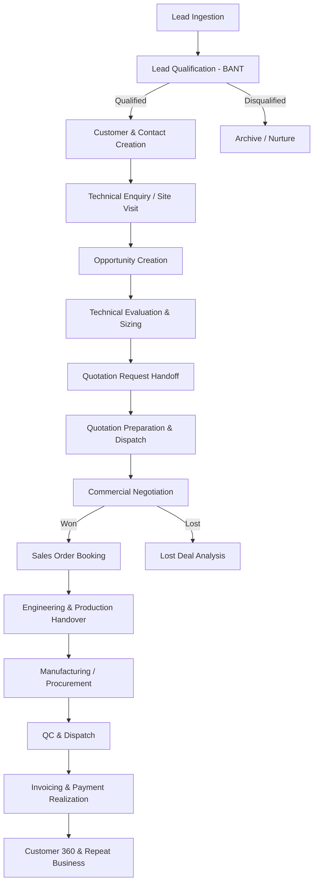

# SAARK ERP — CRM & Sales Business Workflow

**Company:** SAARK EXPLORATION PRIVATE LIMITED  
**Document:** `docs/CRM_BUSINESS_FLOW.md`  
**Architect:** Senior Full-Stack ERP & CRM Architect  
**Date:** October 2026  

---

## 1. High-Level Enterprise Lifecycle

---

## 2. Stage-by-Stage Business Execution

### Stage 1: Lead Ingestion & Attribution
1. **Sources:** IndiaMART inquiries, technical exhibitions, website contact forms, cold calling, dealer referrals, and existing client recommendations.
2. **Data Capture:** Ingests company name, key contact, location, phone, email, and preliminary product interest (e.g., Booster Pump System, Fire Panel, Sewage Treatment Automation, Dewatering Panel).
3. **Assignment:** Automatic or manual assignment to a Sales Executive based on geographical territory (e.g., Pune, Mumbai, Rest of Maharashtra, Gujarat) or product specialization.

### Stage 2: Lead Qualification (BANT Framework)
1. **Initial Contact:** Executive logs a Call or WhatsApp interaction within 24 hours of lead ingestion.
2. **Evaluation:**
   * **Budget:** Client's allocated financial envelope for the electrical panel or pump system.
   * **Authority:** Verification that the contact is the Project Manager, Electrical Consultant, or Purchase Head.
   * **Need:** Concrete site requirements (e.g., 2-pump booster with VFD, 7.5 HP motors, 415V supply).
   * **Timeline:** Target installation deadline.
3. **Outcome:**
   * If qualified: Lead status marked `QUALIFIED`.
   * If disqualified: Reason logged (`NO_BUDGET`, `STUDENT_ENQUIRY`, `OUT_OF_GEOGRAPHY`).

### Stage 3: Customer Conversion & Master Setup
1. **Conversion Action:** Triggered from the lead profile.
2. **Master Generation:**
   * Converts the entity into an active or prospective `Customer`.
   * Enforces duplicate verification against GSTIN, phone, and company name.
   * Promotes the lead contact to the primary `CustomerContact`.
   * Automatically initializes `CustomerValuation` and `CustomerTimeline`.

### Stage 4: Site Visit & Technical Discovery
1. **Site Inspection:** Essential for SAARK's engineering projects (water treatment, pump skids, MCC/PCC panels).
2. **Field Data Collection:**
   * Electrical specifications: Line voltage, motor HP, starter preference (VFD vs. Soft Starter vs. Star-Delta).
   * Physical site conditions: Space constraints, IP rating requirements (IP55/IP65), ambient temperature.
   * Photo & document uploads: Site photos, single line diagrams (SLD).
3. **Follow-up Scheduled:** Mandatory next milestone date set for technical sizing.

### Stage 5: Opportunity Progression & Technical Evaluation
1. **Opportunity Creation:** Linked to the customer and enquiry.
2. **Stage Progression:**
   * `QUALIFICATION` (10% Probability)
   * `REQUIREMENT_ANALYSIS` (25% Probability)
   * `TECHNICAL_EVALUATION` (40% Probability)
   * `QUOTATION_SENT` (60% Probability)
   * `NEGOTIATION` (80% Probability)
   * `CLOSED_WON` (100% Probability)
   * `CLOSED_LOST` (0% Probability)
3. **Probability-Weighted Pipeline:** Calculates expected company revenue:
   $$\text{Weighted Value} = \text{Estimated Amount} \times \text{Stage Probability}$$

### Stage 6: Quotation Handoff
1. **Handoff Package:** The Opportunity automatically passes all customer details, BOM line items, motor specifications, and commercial margin targets to the Core Sales & Quotation module.
2. **Version Control:** If customer requests revisions (e.g., switching from Schneider to ABB VFD), each quotation revision is tracked and mirrored in the CRM Opportunity timeline.

### Stage 7: Commercial Negotiation & Closing
1. **Negotiation Activities:** Phone calls, office meetings, and discount discussions are logged as interactions.
2. **Closing:**
   * **WON:** Requires uploading the Purchase Order (PO) document or recording the PO number. Triggers creation of a Sales Order and project initialization.
   * **LOST:** Requires selecting a mandatory lost reason (`COMPETITOR_PRICE`, `TIMELINE`, `SPEC_MISMATCH`) and competitors involved for executive loss analysis.

### Stage 8: Post-Sale Customer 360 & Relationship Growth
1. **Lifecycle Tracking:** Invoices, payment receipts, warranty cards, and dispatch details are linked back to the Customer 360 view.
2. **Valuation Score Update:** High order frequency and prompt payment history elevate the customer's valuation percentage and rating score.
3. **Repeat Business:** Automated follow-up alerts remind sales executives of upcoming AMC renewals, filter replacements, or planned facility expansions.
