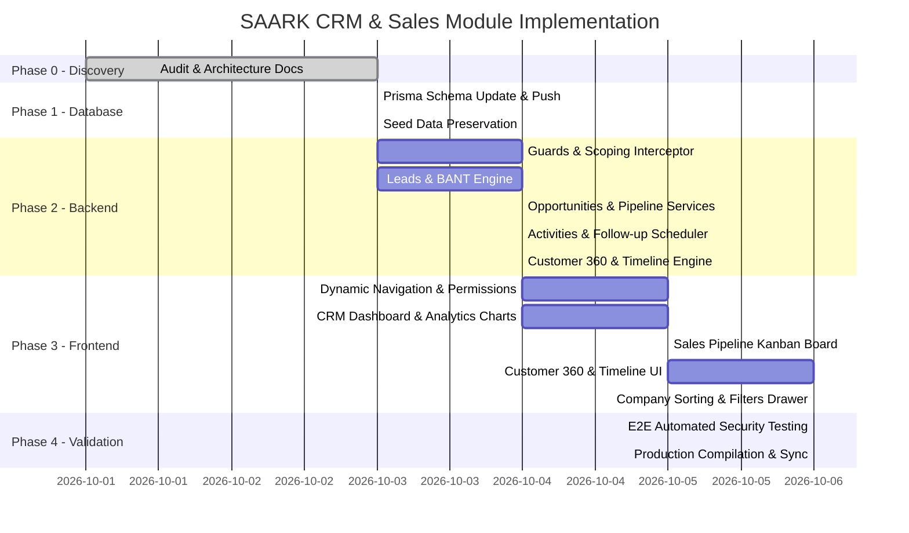

# SAARK ERP — CRM & Sales System: Implementation Roadmap & Execution Plan

**Company:** SAARK EXPLORATION PRIVATE LIMITED  
**Document:** `docs/CRM_IMPLEMENTATION_PLAN.md`  
**Architect:** Senior Full-Stack ERP & CRM Architect  
**Date:** October 2026  

---

## 1. Phased Execution Roadmap

---

## 2. Phase-by-Phase Deliverables

### Phase 1: Database Schema Expansion (`schema.prisma`)
* Expand `Customer` and `Lead` models with relational bindings to `Staff`.
* Add `Opportunity`, `CrmActivity`, `CrmCall`, `CrmMeeting`, `CrmSiteVisit`, `CrmFollowUp`, `CustomerDocument`, `CustomerMedia`, and `CrmSavedFilter`.
* Execute `npx prisma db push` and `npx prisma generate` to update types without dropping existing customer data.

### Phase 2: Backend CRM Core Engine (`apps/backend`)
* Implement record-level scoping helper (`getStaffScopeQuery(user)`).
* Implement `OpportunitiesService` and `OpportunitiesController` with pipeline stage aggregation.
* Implement `CrmActivitiesService` for calls, meetings, site visits, and follow-ups.
* Implement atomic `convertLead` transaction linking Customer, Contact, and Opportunity.
* Implement `checkDuplicate` and `mergeCustomers` endpoints.

### Phase 3: Frontend CRM Experience (`apps/mobile`)
* Refactor `app_router.dart` and `app_shell.dart` with dedicated CRM sub-routes:
  * `/crm/dashboard`
  * `/crm/pipeline`
  * `/crm/follow-ups`
  * `/crm/analytics`
  * `/customers/search`
* Build `CrmPipelinePage` (Kanban drag-and-drop).
* Upgrade `CustomerDetailPage` into `Customer360Page` with full chronological timeline and active tabs.
* Build `CrmFollowUpsPage` with Overdue and Today alert badges.
* Build `CrmAnalyticsPage` with interactive product, lead source, and funnel charts.

### Phase 4: Quality Assurance, Security & Deployment
* Run E2E verification test suite (`verify_crm_system.ts`).
* Validate Zero Extra UI: Log in as Sales Executive and confirm Admin/Purchase/Export options are completely absent.
* Compile Flutter Web bundle and sync to `apps/backend/public`.
* Deploy via Git commit and push to Render.
