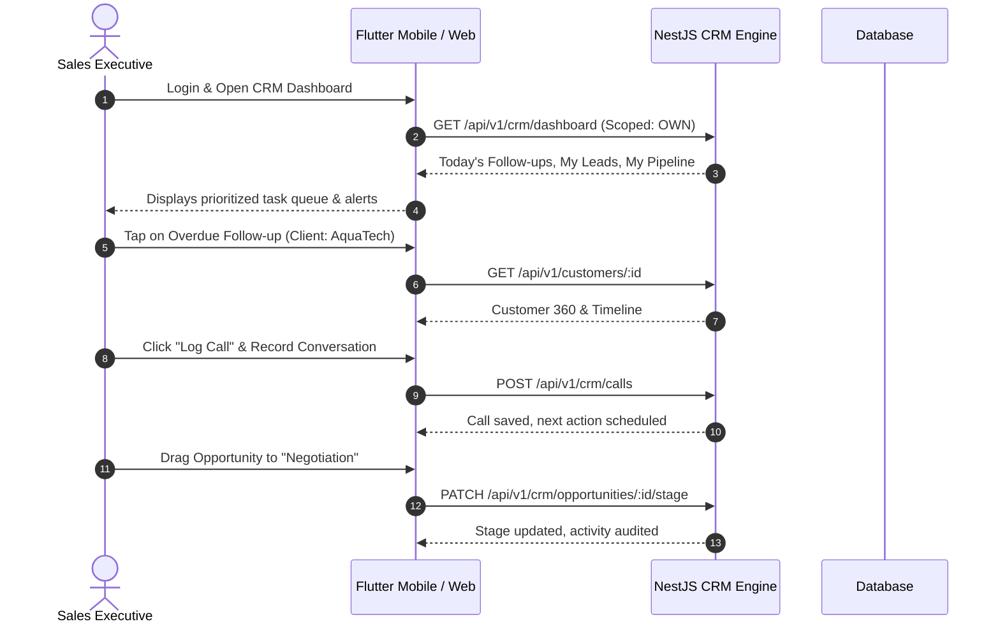
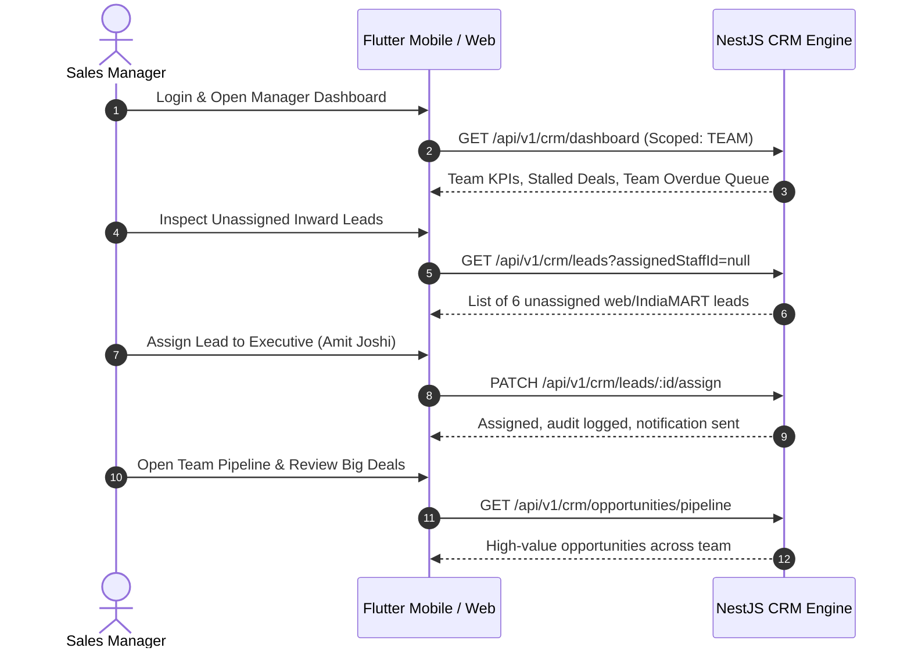

# SAARK ERP — CRM & Sales System: Persona User Flows

**Company:** SAARK EXPLORATION PRIVATE LIMITED  
**Document:** `docs/CRM_USER_FLOWS.md`  
**Architect:** Senior Full-Stack ERP & CRM Architect  
**Date:** October 2026  

---

## 1. Sales Executive Daily Workflow

### Detailed Flow Steps:
1. **Morning Inspection:**
   * Executive logs into SAARK ERP.
   * Lands on personalized **CRM Dashboard** showing only own assignments.
   * Inspects "Follow-ups Today" (e.g., 4 scheduled) and "Overdue Follow-ups".
2. **Engagement & Logging:**
   * Opens the top overdue lead or customer record.
   * Taps the primary contact's phone or WhatsApp quick-action icon.
   * Conducts discussion on panel delivery or pump quotation.
   * Immediately records the call outcome (`CONNECTED`, `INTERESTED`), conversation summary, and selects a mandatory next follow-up date (e.g., 2 days later).
3. **Pipeline Maintenance:**
   * Navigates to the **Sales Pipeline (Kanban)**.
   * Updates opportunity stage based on client acceptance (e.g., moves from `TECHNICAL_EVALUATION` to `QUOTATION_SENT`).
   * If customer confirms purchase order, clicks "Mark as Won", enters PO reference number, and attaches PO PDF.
4. **Site Visit Documentation:**
   * While in the field on mobile, opens "Site Visits".
   * Logs site address, electrical line specifications, takes 3 photos of the pump room, and enters technical recommendations.

---

## 2. Sales Manager Daily Workflow

### Detailed Flow Steps:
1. **Team Health & Assignment:**
   * Evaluates aggregate team metrics: Total Pipeline Value, Monthly Won Orders vs. Target.
   * Reviews incoming unassigned leads from digital campaigns and website inquiries.
   * Distributes leads among sales executives based on territory and current workload.
2. **Pipeline Hygiene & Escalation:**
   * Reviews the **Overdue Follow-up Queue** across all reporting executives.
   * Identifies stalled high-value opportunities (e.g., > ₹10 Lakhs in negotiation for > 15 days).
   * Reassigns dormant accounts or schedules a joint customer meeting with senior technical staff.
3. **Quotation & Commercial Review:**
   * Reviews quotations pending customer signoff.
   * Approves special commercial discount requests submitted by executives.

---

## 3. Super Administrator Daily Workflow

1. **System Health & Governance:**
   * Evaluates overall company sales throughput, conversion ratios, and win-loss distribution.
   * Monitors audit trails for stage manipulations, unauthorized export attempts, and record deletions.
2. **Data Deduplication & Master Cleansing:**
   * Accesses the **Duplicate Intelligence Dashboard**.
   * Identifies conflicting customer accounts with identical GSTIN or phone records.
   * Executes administrative merges, combining duplicate records into the authoritative Master Customer while preserving full historical ledgers.
3. **Configuration & Access Control:**
   * Configures CRM master parameters: Lead Sources, Customer Segments, Product Master linkages, and Lost Reasons.
   * Manages staff role assignments and security permission boundaries.
